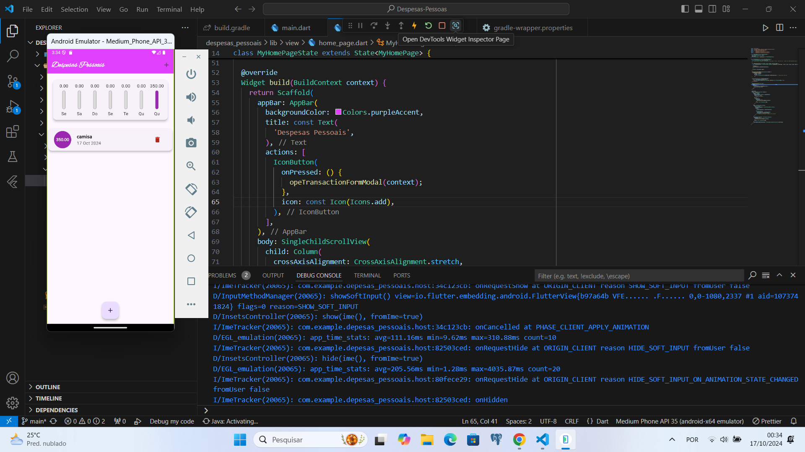

# Depesas-Pessoais
Este aplicativo foi desenvolvido com o objetivo de auxiliar no controle financeiro pessoal ao longo da semana, permitindo um acompanhamento detalhado dos gastos. Ao realizar o download ou o clone deste projeto, é necessário executar o seguinte comando no terminal para instalar todas as dependências do Flutter: **flutter pub get**
Este comando garantirá que todas as bibliotecas e pacotes necessários para o funcionamento do aplicativo sejam devidamente instalados.

### Imagem
